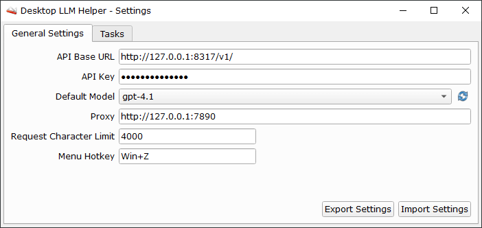
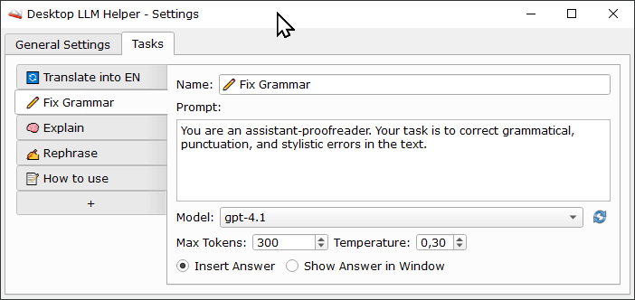
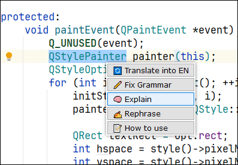
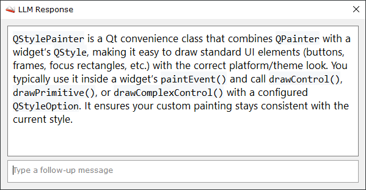

<div align="center">
  

# Desktop LLM Helper

A Windows desktop application that enables seamless text processing with Large Language Models from any application.
Select text anywhere, trigger a hotkey, and instantly send it to your LLM for processing. Results can be inserted
directly back into your workflow or displayed in an interactive chat dialog.

  
</div>

## Features

- **System-wide hotkey integration**: Access LLM capabilities from any application
- **Customizable task presets**: Configure multiple tasks with different prompts and behaviors
- **Flexible response handling**:
    - **Insert Mode**: Automatically paste LLM responses directly into the active application
    - **Dialog Mode**: View responses in a dedicated chat window with conversation history
- **Clipboard integration**: Seamlessly captures selected text and returns results via system clipboard
- **Multiple LLM provider support**: Works with OpenAI-compatible API endpoints

## How It Works

1. **Configure Tasks**: Set up custom tasks with specific prompts (e.g., "Translate to English", "Fix Grammar", "Explain
   Concept")
2. **Set Global Hotkey**: Define a system-wide keyboard shortcut to trigger the task menu
3. **Use Anywhere**: Select text in any application and press your configured hotkey
4. **Choose Task**: A popup menu displays your configured tasks
5. **Automatic Processing**:
    - The application captures the selected text (simulates Ctrl+C)
    - Sends it to your LLM with the task's prompt
    - Returns the response based on your configuration:
        - **Insert Answer**: Automatically pastes the result (simulates Ctrl+V)
        - **Show in Window**: Opens an interactive chat dialog for further conversation

## Use Cases

- Translation between languages
- Grammar and spelling correction
- Text rephrasing and style adjustment
- Technical term explanations
- Code documentation and refactoring
- Summarization and content analysis
- And many more...

---

## How to Use

1. Find the tray icon and open Settings.

   

2. Configure the LLM connection (API base URL, API key, hotkey), then save the settings.

   

3. Open **Tasks** and create the tasks you want to run (prompt, model, response mode).

   

4. Select text in any app and press the configured **hotkey** to open the task menu.

   

5. Run a task. The response is either inserted into the current text field or shown in a dialog, depending on the task settings.

   


---

## Build

Requirements:

- Windows
- Qt 6.x (mingw_64) with Widgets and Network
- CMake 3.16+ (Qt Tools)
- Ninja (Qt Tools)
- MinGW (Qt Tools)

Example build using Qt Tools (CMake + Ninja + MinGW):

```
"C:\Qt\Tools\CMake_64\bin\cmake.exe" -S . -B cmake-build-debug -G Ninja ^
  -DCMAKE_CXX_COMPILER="C:/Qt/Tools/mingw1310_64/bin/g++.exe" ^
  -DCMAKE_RC_COMPILER="C:/Qt/Tools/mingw1310_64/bin/windres.exe" ^
  -DCMAKE_MAKE_PROGRAM="C:/Qt/Tools/Ninja/ninja.exe" ^
  -DQT_DIR="C:/Qt/6.8.1/mingw_64/lib/cmake/Qt6"
"C:\Qt\Tools\CMake_64\bin\cmake.exe" --build cmake-build-debug
```
